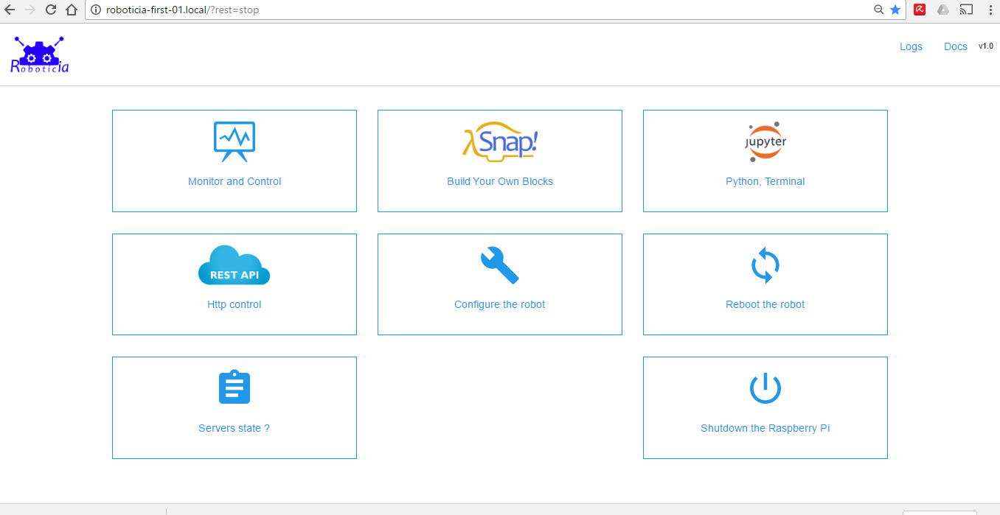

# Djangoticia: a Control Web Interface for Roboticia and Poppy robots. Based on Django.

**Warning : Djangoticia is mainly intended to work on a Raspberry-Pi to work with Roboticia robots. Because Roboticia robots are Poppy compatible, it could also works with Poppy robots. You can find a SD card image for RPI3 with Djangoticia already installed [here](http://www.roboticia.com/?page_id=258).
Anyway, Djangoticia can work (without all functionalities) on other systems like windows. It can also drive simulated robots on [VREP](http://www.coppeliarobotics.com/).**

## Installation

* Download this repository. And extract it.

* Install the dependencies ([Django](https://www.djangoproject.com/), [wifi](https://wifi.readthedocs.io/en/latest/), [psutil](http://pythonhosted.org/psutil/), [Jupyter](http://jupyter.readthedocs.io/en/latest/install.html) and [requests](http://docs.python-requests.org/en/master/)).
 You also need to have at least one robot installed (for example : [Roboticia-first](https://github.com/Roboticia/Roboticia-first)) via :

```bash
pip install -r requirements.txt
```

**Warning : Djangoticia plugs its command on Pypot (a dependency of Roboticia-first). If you experiment difficulties to install Pypot(http://github.com/poppy-project/pypot), the best choice is to take a scientific Python distribution with all onboard like : [anaconda](http://www.continuum.io/downloads).**

## Usage

To start the web interface, simply run the *manage.py* script:

```bash
python manage.py runserver
```

It will start the test webserver on localhost and use the default port 8000. So, you can now connect to http://localhost:8000 and see this:



**Warning : This will run the Django test server. To serve the pages in production mode, you have to use a web server in addition of Django. Apache and mod_wsgi is a possibility. Configuration of production mode really depends on your system and need some skills in webserver management. Here is the [documentation](https://docs.djangoproject.com/en/1.10/howto/deployment/wsgi/modwsgi/).
For all questions or requests for support, please use the [poppy forum.](https://forum.poppy-project.org/)**


*Powered by [poppy project](https://www.poppy-project.org/en/)*
